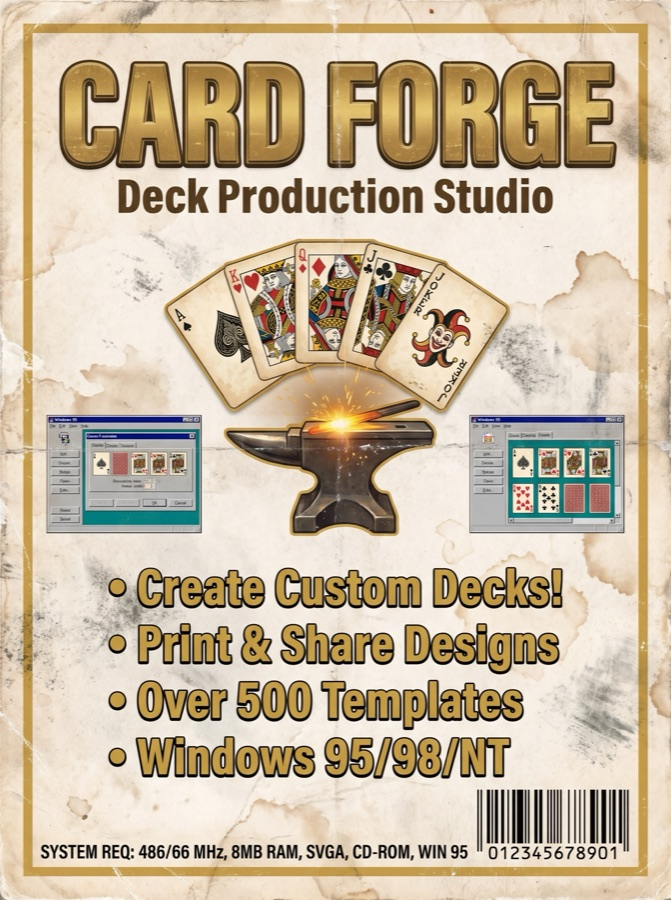
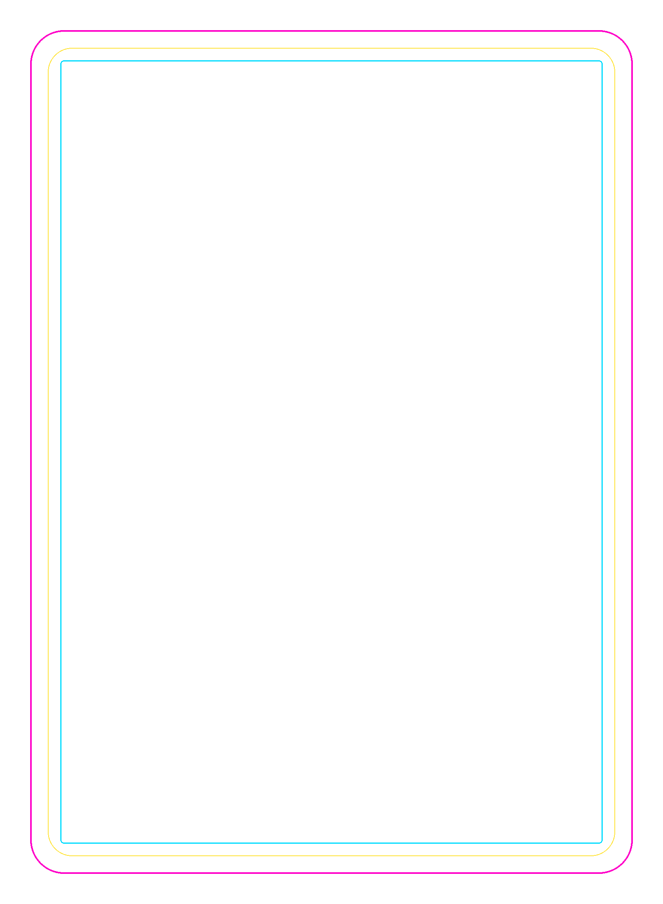
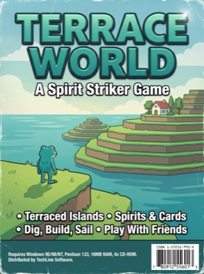
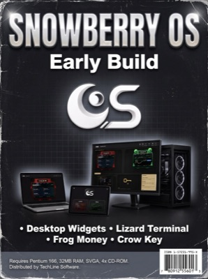
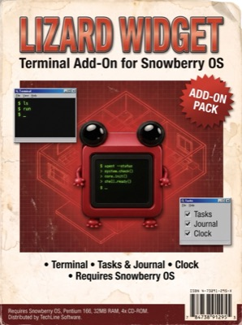
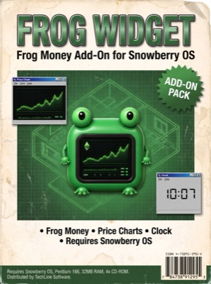
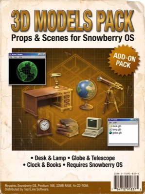
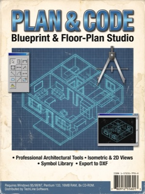
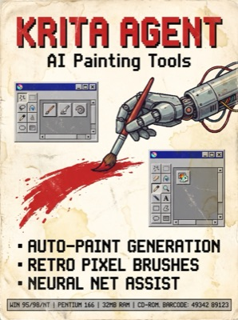

# Card Forge



A card-game production studio, built to make the **Spirit Strikers** 49-card deck: a
browser-based drag-and-drop deck editor plus a chain of Python build scripts that turn
hand-drawn line art into print-ready poker cards — procedural marble borders, 98 unique
glass-marble corner badges, Krita `.kra` paint files with inherit-alpha clipping, and
contact sheets for sign-off.

Everything visual is generated in code. No stock textures, no flat PNG reuse.

## Features

- **Deck editor** (`deck-editor.html`) — a 7×7 grid (7 categories × 7 elements) rendered
  live on `<canvas>`. Drag any artwork onto another card to swap positions; the line art
  instantly recolors to the destination element. Frames and numbered marbles stay put.
  Light/dark card interiors, a live line-thickness slider, one-click export of full deck
  sheets (PNG) and the current `arrangement.json`.
- **Procedural marble renderer** (`scripts/marble_render.py`) — every corner badge is a
  9-layer physically-motivated glass orb (diffuse, fresnel rim, transmission glow, crisp
  specular…). 49 cards × 2 marbles = 98 unique orbs from per-(card, slot) SHA-1 seeds,
  yet the deck stays cohesive because the light direction and faction colors are locked.
  Full recipe in [MARBLE-RECIPE.md](MARBLE-RECIPE.md).
- **Print-spec borders** (`scripts/build_marble_borders.py`, `scripts/build_poker_borders.py`)
  — full-bleed faction frames at 600 DPI (1650×2250 px = 2.5×3.5 in + 1/8 in bleed), with
  trim/safe/window guide overlays.
- **Vector-traced line art** (`scripts/trace_lineart.py`, `scripts/bake_vector_art.py`) —
  potrace tracing + XOR parity fill + uniform thinning kills upscale pixelation at the root.
- **Krita assembly** (`scripts/build_poker_kra.py`, `scripts/build_49_marble_kra.py`) —
  kritarunner scripts that build layered `.kra` files where every paintable layer is an
  **inherit-alpha** clipping layer: paint freely, nothing spills outside the shape.
- **Deck variants** (`scripts/deck_variant.py`) — WHITE (black line art on white) and BLACK
  (white line art on dark) versions that differ *only* in the cutouts; colors identical.
- **Contact sheets** (`scripts/contact_sheet.py`, `scripts/white_contact.py`,
  `scripts/front_preview.py`) — labeled 7×7 review sheets and clean single-card fronts.

Read the full story in [MAKING-OF.md](MAKING-OF.md), and see [PROMPT.md](PROMPT.md) for a
self-contained prompt to rebuild the whole tool with an AI coding agent.

## Quick Start

The deck editor is a single static HTML file — serve the repo root and open it:

```bash
cd card-forge
python3 -m http.server 8080
# then open  http://localhost:8080/deck-editor.html
```

It loads `plan.json`, the borders, and all 98 marbles from this repo. Drag artwork
between cells, flip Light/Dark, tweak line thickness, then export:

- **⬇ Light PNG / ⬇ Dark PNG** — full 49-card deck sheet
- **⬇ arrangement.json** — the current card layout for the build scripts

> Note: the character/scene line-art cutouts are Blu's original drawings and are not
> bundled (the editor's `CUT` constant at the top of the script points at
> `../../spirit-strikers-deck/images/cards-vector/`). Without them the editor still runs —
> you get borders, marbles, and the element-emblem row. Point `CUT` at `sample-art/` (or
> your own PNG cutouts named `card-NN.png`) to see artwork.

### Build scripts

The Python scripts need `numpy` and `Pillow`; some also use `scipy`, `potracer`
(pure-Python potrace), and `PyMuPDF`:

```bash
pip3 install numpy Pillow scipy potracer PyMuPDF
```

The pipeline, in order:

```bash
python3 scripts/build_marble_borders.py   # 7 faction borders + guides + window base
python3 scripts/plan_cards.py             # 7x7 plan.json + placed art crops
python3 scripts/build_marbles_98.py       # 98 unique corner marbles
python3 scripts/contact_sheet.py          # labeled 7x7 review sheet
python3 scripts/deck_variant.py           # _DECK-WHITE.png + _DECK-BLACK.png
```

Krita assembly (needs [Krita](https://krita.org) and its `kritarunner` CLI):

```bash
kritarunner -s build_poker_kra            # 49 layered .kra card files
kritarunner -s build_49_marble_kra        # one .kra with 49 paintable clipping groups
```

> **Paths:** the scripts were written against the author's working tree and hardcode
> `/Users/blu/card-borders/poker-deck` (the `.kra` builders honor `SS_ROOT` / `SS49_DIR`
> env vars). To run them elsewhere, point those constants at your own working directory.
> The editor + shipped assets in this repo work as-is with no path changes.

## How it works

1. **Plan** — `plan_cards.py` lays 49 cards on a 7×7 grid: rows are categories
   (Characters, Locations, Vehicles, Relics, Story Elements, Motives, Elements), columns
   are elements (water, wood, electric, fire, metal, earth, spirit). Each card's art is
   pre-fit into the border window and dumped as raw BGRA for Krita. Output: `plan.json`.
2. **Borders** — a rounded-rectangle window mask is subtracted from a full-bleed
   rectangle; a procedural "polished marble" gloss field (top-left key light + specular
   streaks + blurred-noise veining) is color-ramped through each faction's
   shadow/mid/highlight palette.
3. **Marbles** — `marble_render.py` shades a unit sphere from its surface normals through
   9 layers, then `build_marbles_98.py` engraves the element symbol (top) or card number
   (bottom) as a deboss: dark fill offset by a light lower lip, so the glyph reads carved
   *into* the glass.
4. **Assembly** — the `.kra` builders stack BACKGROUND / ART / BORDER / GUIDES groups and
   set `inheritAlpha` on every paint layer, giving artists per-shape clipping for free.
5. **Review** — contact sheets and the deck editor render the exact same assets at thumb
   scale, so what you sign off is what prints.

Faction palette (single source of truth, `borders/borders_manifest.json`):
fire `#c22c37` · water `#1c6baf` · wood `#85dc7b` · electric `#d3cf61` ·
earth `#684a36` · spirit `#64318f` · metal `#5a6068`.

## Screenshots

| Fire border (600 DPI, full bleed) | Spirit gem emblem | Corner marble (card 1, symbol) | Trim/safe/window guides |
|---|---|---|---|
|  |  |  |  |

All 98 corner marbles live in [`marbles/`](marbles/) — every one a unique swirl.

## Repo layout

```
deck-editor.html        drag-and-drop deck editor (single file, zero deps)
plan.json               the 7x7 deck plan (cards, elements, art placement)
card-categories.json    card-id -> category mapping
MARBLE-RECIPE.md        how every glass marble is built (the 9 layers)
MAKING-OF.md            the full production story
PROMPT.md               recreate this tool from scratch with an AI agent
borders/                7 faction border PNGs + window base + guides + manifest
elements/               7 gem emblems + 7 extracted element glyphs
marbles/                98 unique corner marbles (NN_top / NN_bot)
sample-art/             drop line-art cutouts here to feed the editor
scripts/                the 20 Python build scripts
```

## Publish

```bash
gh repo create Frog-dex/card-forge --public --source . --push
```

## The Sovereign Software shelf

Every box on the Spirit Strikers software shelf. Put the discs in the terminal here: https://frog-dex.github.io/terrace-world/library.html#software

| <a href="https://github.com/Frog-dex/terrace-world"></a> |  |  |  |
|:--:|:--:|:--:|:--:|
| **Terrace World**<br>the game | **Snowberry OS**<br>early build, not released yet | **Lizard Widget**<br>add-on, not released yet | **Frog Widget**<br>add-on, not released yet |

| <a href="https://github.com/Frog-dex/3d-models-pack"></a> | <a href="https://github.com/Frog-dex/plan-and-code"></a> | <a href="https://github.com/Frog-dex/krita-agent"></a> | <a href="https://github.com/Frog-dex/card-forge"></a> |
|:--:|:--:|:--:|:--:|
| **3D Models Pack**<br>thirteen free models | **Plan & Code**<br>plan a page, hand it to an AI | **Krita Agent**<br>AI tools inside Krita | **Card Forge**<br>card-making studio |

## License

MIT © 2026 Blu Inman. The Spirit Strikers artwork, characters, and brand remain
© Blu Inman — the code is free, the world is his.
